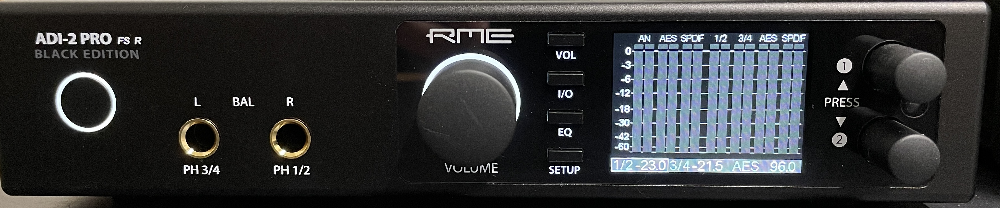
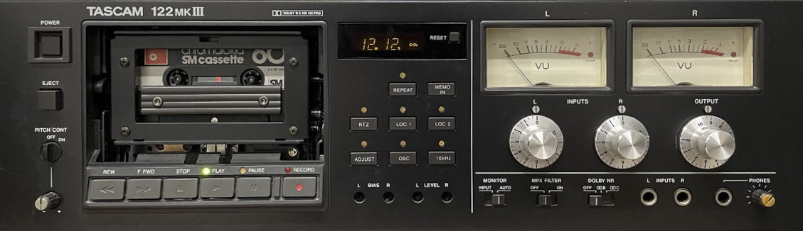
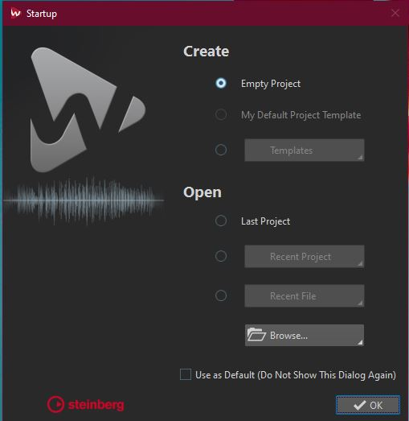
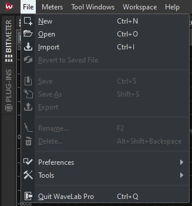
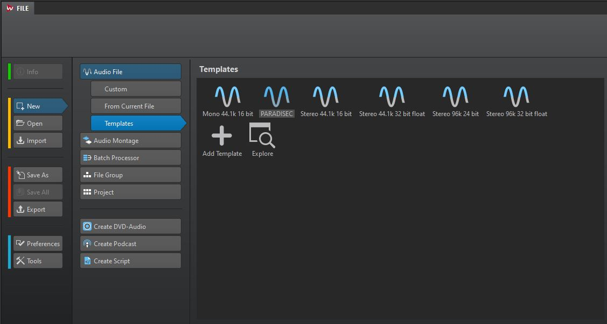
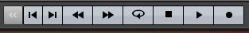
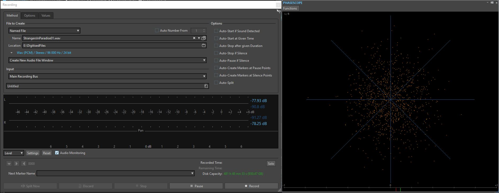
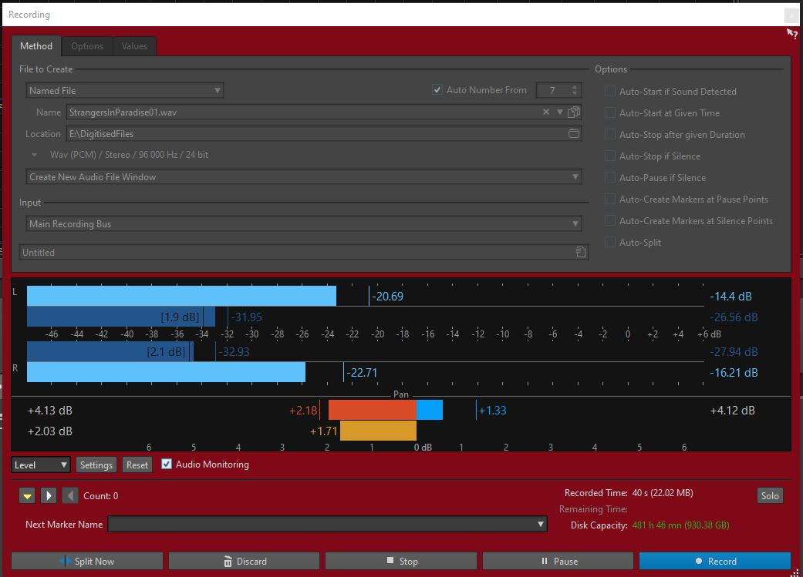
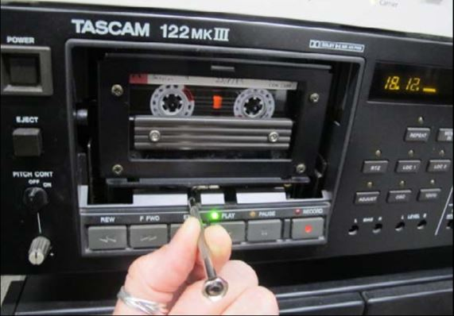
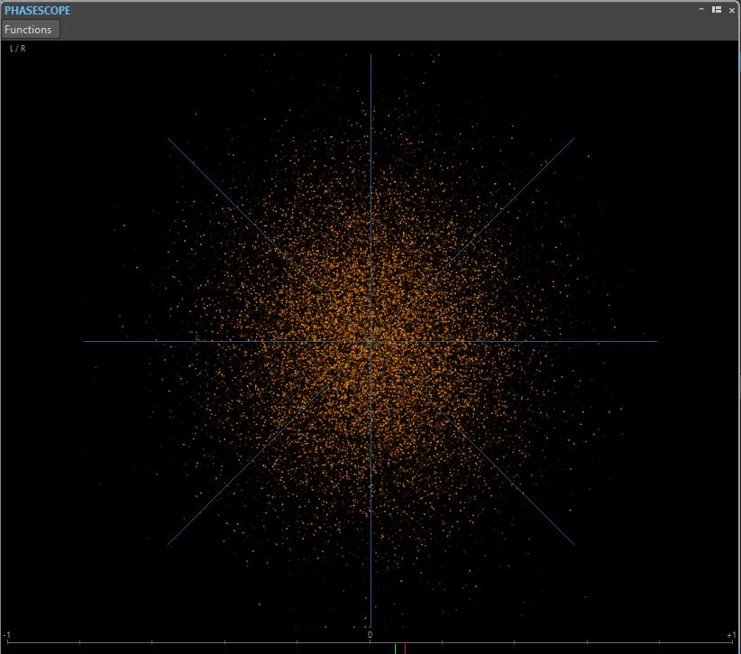

# Audio Digitising Workflows for PARADISEC Archive

🚧 This page is currently under construction, last edited on 2021-06-15 🚧

  

This page outlines the technical workflow for audio digitising for the PARADISEC unit based at the Australian National University. This worlflow can be modified to accommodate other organisations in their specific digitising goals.

## Digitising Cassette Tapes

#### 1.	Turn on computer and login with your ANU UDS credentials

Recources you should find on your desktop:
Wavelab Pro 10.0 shortcut
Wavelab Pro 10.0 operations manual

#### 2.	Turn on the [RME ADI-2 PRO FS](https://www.rme-audio.de/adi-2-pro-fs.html) AD/DA Convertor

  

#### 3.	Turn on and load a tape into the Tascam 122 mk II

  

#### 4.	Click on the Wavelab shortcut.

  

##### You may need to select New Project if presented with a start-up window. 

  

##### Otherwise, the main Wavelab window will open up

  

##### Make sure the Workspace layout is the PARADISEC layout. Go to the banner menu at the top and select Workspace > Layout > PARADISEC

  

#### 5.	Once main window opens, go up to the banner menu again and select File > New.

  

#### 6.	Another window pops up asking you to select the template. Select PARADISEC.

  

#### 7.	A new timeline will appear in the AUDIOEDITOR window located in the lower half of the main window. In this window, select the ANALYZE tab along the top.
  Make sure to tick the radio button next to Audio Input
  

  

From the meter tabs in the upper right quadrant of the main window, grab the PHASESCOPE and drag it out to create a popped-out, larger window.

#### 8.	look to the buttons on the bottom of the window
  

  

Press the button with the dot on it, far right. This will open the following recording window and activate the PHASESCOPE:
  

  

#### 9.	In Method tab under File to Create, select Named file from the drop down menu, then type in the file name you want to assign this file. Select the target location, E:\DigitisedFiles for the output files.

#### 10.	Play the tape as a means to test the levels audio levels to recording. These can be seen in the Recording window. Play for a minute or so, making sure the signal stays below -12.00 dB. 
  

  

#### 11.	If the signal on the tape is too loud, you should adjust this on the TASCAM using the OUTPUT dial on the far right of the tape machine. The dial should be on 8 to begin with. Make adjustments from there.
  

  

#### 12.	Once you adjust the volume, press the Reset button underneath the audio levels back in Wavelab so that you can confirm you have adjusted the audio adequately.
  

  

#### 13.	As you are previewing the tape, you can see that the PHASESCOPE is also actively monitoring the audio. We will use this scope to help guide us in our Azimuth adjustment. 

    
#### 14.	You can find the Azimuth screw on the TASCAM machine in the gap right above where the word STOP button. It is the screw to the left of the heads. Use the supplied tiny screwdriver.
  

  

#### 15.	Look at the PHASESCOPE as you turn the screw to the left and to the right. Because you will be mostly digitising one-sided tapes, you want the line to be straight and along the Y-axis (vertical). If you were to digitise a reel-to-reel tape that is recorded on both sides, both sides are digitised simultaneously. As a result, there will be more of an X -shape of lines, representing each output of the tape.
  

  

  

  

  

  

#### 16.	Once you get the cleanest, most vertical line you can, rewind the tape, press Record in Wavelab, then press play on the TASCAM. 

## Additional Resources
[Pragmatic Audiovisual Preservation](http://doi.org/10.7207/twr20-10) (2021) Ashley Blewer

[IASA Technical Committee, Guidelines on the Production and Preservation of Digital Audio Objects](https://www.iasa-web.org/tc04/audio-preservation) (2009, 2nd ed.) ed. by Kevin Bradley.

[Sound Directions: Best Practice for Audio Preservation](http://www.dlib.indiana.edu/projects/sounddirections/papersPresent/index.shtml) (2007) Mike Casey & Bruce Gordon

